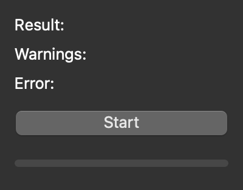
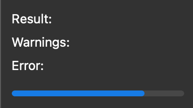
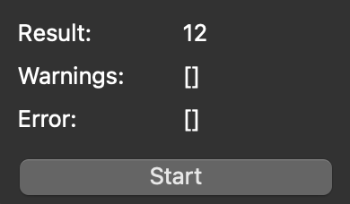

# PySink

Created by Zack Johnson

<span style="color:red">
Under construction, not ready for use!
</span>

PySink is an extension of the PySide6 Qt Framework that simplifies the implementation
of Asynchronous tasks in your Desktop Applications. It contains several
helper Widgets and Classes that enable you to build powerful and professional
desktop applications without worrying about managing threads or freezing 
UI with long-running tasks. PySink's implementation suggests an MVC 
architecture for your application, but should perform well in other architectures
such as MVVM.

## Getting Started
PySink is based on the concept of Workers and Managers. Workers are custom objects that 
perform your long-running tasks. They inherit from the provided *AsyncWorker* class and 
override the *AsyncWorker.run()* method to perform the tasks, emitting progress values and 
optional status messages along the way. These workers are managed by a generalized object called the *AsyncManager*. 

The Manager is an object that manages all the threading, passes along the signals and values 
emitted by the Worker, and handles the cancellation of said threads and workers when necessary.

Let's look at a couple examples to help you get started. Full examples and all source code can 
be found at https://github.com/zackjohnson298/PySink

### Example 1: Defining and Using a Custom Async Worker
In this first example, we will create a custom AsyncWorker that performs *time.sleep()* 
for a specified duration and number of cycles. To create a new worker, define a class
that inherits from *PySink.AsyncWorker*. Any values needed by the worker should be passed
in via it's *\_\_init\_\_* method: 

```python
from PySink import AsyncWorker


class DemoAsyncWorker(AsyncWorker):
    def __init__(self, delay_seconds: int, cycles=4):
        super(DemoAsyncWorker, self).__init__()
        # Store the values passed in during initialization
        self.delay_seconds = delay_seconds
        self.cycles = cycles
```
To implement your long-running task, simply override AsyncWorker's *run* method.
This method takes no parameters and returns nothing, it just performs your task. 
Progress/status is emitted by calling the *self.update_progress(progress, message)*
method, and when your task is done you can emit any results via the 
*self.complete(\*\*kwargs)* method:

```python
from PySink import AsyncWorker
import time


class DemoAsyncWorker(AsyncWorker):
    def __init__(self, delay_seconds: int, cycles=4):
        super(DemoAsyncWorker, self).__init__()
        self.delay_seconds = delay_seconds
        self.cycles = cycles

    def run(self):
        progress = 0
        progress_increment = 100 / self.cycles
        # Update progress by providing a progress value from 0-100 with an 
        #   optional message
        self.update_progress(0, 'Starting Task')
        for ii in range(self.cycles):
            time.sleep(self.delay_seconds)
            progress += progress_increment
            self.update_progress(progress, f'Progress message #{ii + 1}')
        # Call the self.complete method to end your task, passing any 
        #   results as keyword arguments
        demo_result = 12
        self.complete(demo_result=demo_result)
```
Starting your custom worker is as simple as creating an AsyncManager, tying 
its signals to your callback methods, and passing your custom Worker to its *start_worker(worker)* method. 
*(We also need a QApplication running for the event loop 
to start, which you will already have in your PySide6 Application).* Let's see 
what this looks like in code:

```python
from PySide6.QtWidgets import QApplication
from PySink import AsyncManager

# Function to be called whenever progress is updated
def progress_callback(progress_value: int, message: str):
    print(f'Progress Received, value: {progress_value}, message: {message}')

# Function to be called when the worker is finished
def completion_callback(results: dict):
    print(f'\nWorker Complete!')
    print(f'\tErrors: {results.get("errors")}')
    print(f'\tWarnings: {results.get("warnings")}')
    print(f'\tResult: {results.get("demo_result")}')


def run_main():
    app = QApplication()
    manager = AsyncManager()
    # Connect the Manager's signals to your callbacks
    manager.worker_progress_signal.connect(progress_callback)
    manager.worker_finished_signal.connect(completion_callback)
    # Create your Worker, and pass in the necessary values
    demo_worker = DemoAsyncWorker(1, cycles=3)
    # Start the Worker
    manager.start_worker(demo_worker)
    
    app.exec()

run_main()
```

Let's first take a look at the progress callback. Progress is emitted by the manager's 
*worker_progress_signal* and contains the progress value as well as the optional message.
It should be tied to the callback function that handles progress events. In this example,
the progress callback simply prints out the progress value and the message.
In the next example, we will look at how to tie this to the *ProgressBarWidget* provided 
in the *PySink.Widgets* module.

The completion callback is tied to the manager's *worker_finished_signal*. This signal
emits the results of the worker's task as a dictionary. It is keyed by the keyword arguments
defined when the *self.complete(\*\*kwargs)* method is called within the worker. This
dictionary also contains the worker's *warnings* and *errors*.

Running the code above results in the following being printed to the console:
```commandline
Progress Received, value: 0, message: Starting Task
Progress Received, value: 33, message: Progress message #1
Progress Received, value: 66, message: Progress message #2
Progress Received, value: 100, message: Progress message #3

Worker Complete!
	Errors: []
	Warnings: []
	Result: 12
```
Congratulations! You've just implemented an AsyncWorker that runs a task in a background thread.
Running the task like this has freed up the UI thread, allowing your users to still interact
with your application without freezing the UI. Full example code can be found at 
https://github.com/zackjohnson298/PySink 
in the examples/example1 folder.

In the next example, we will see how to use PySink to create a basic asynchronous App. 
We'll also see how to use the provided ProgressBarWidget to display the progress of your 
asynchronous task to the user.

### Example 2: Create a Basic Asynchronous App
Now let's create a desktop app that allows the user to start a long-running task and monitor 
its progress within the UI. This example will follow a basic MVC architecture.

PySink includes a helper Widget called the ProgressBarWidget that packages up some helpful
progress bar functionality into a single class. This widget allows you to easily display 
discrete progress values from 0-100, show an indeterminate progress state by passing in a negative
value, and (on Windows) set text that gets overlaid on the progress bar (refer to the docs for
more information).

Let's get started building the App. Since this is a demo of PySink and not a PyQt tutorial, I 
will not dive too deep into PySide6 Windows, Widgets, or layout management. Start by 
setting up a basic View that inherits from QMainWindow, and populate the view with some 
widgets:

```python
from PySide6.QtWidgets import QMainWindow, QVBoxLayout, QPushButton, QWidget, QGridLayout, QLabel
from PySide6.QtCore import Signal
from PySink.Widgets import ProgressBarWidget


class MainView(QMainWindow):
    button_pushed_signal = Signal()

    def __init__(self):
        super(MainView, self).__init__()

        # Widgets
        self.button = QPushButton('Start')
        self.progress_bar = ProgressBarWidget()
        self.result_label = QLabel()
        self.warnings_label = QLabel()
        self.errors_label = QLabel()

        # Connect Signals
        self.button.clicked.connect(self.button_pushed_signal.emit)

        # Layout
        grid_layout = QGridLayout()
        grid_layout.addWidget(QLabel('Result:'), 0, 0)
        grid_layout.addWidget(QLabel('Warnings:'), 1, 0)
        grid_layout.addWidget(QLabel('Error:'), 2, 0)
        grid_layout.addWidget(self.result_label, 0, 1)
        grid_layout.addWidget(self.warnings_label, 1, 1)
        grid_layout.addWidget(self.errors_label, 2, 1)

        central_layout = QVBoxLayout()
        central_layout.addLayout(grid_layout)
        central_layout.addWidget(self.button)
        central_layout.addWidget(self.progress_bar)
        central_widget = QWidget()
        central_widget.setLayout(central_layout)
        self.setCentralWidget(central_widget)

    def set_result(self, result):
        self.result_label.setText(str(result))

    def set_warnings(self, warnings):
        self.warnings_label.setText(str(warnings))

    def set_errors(self, errors):
        self.errors_label.setText(str(errors))

    def set_progress(self, progress_value, message=None):
        self.progress_bar.set_value(progress_value)
        if message:
            self.progress_bar.set_text(message)

    def clear(self):
        self.warnings_label.setText('')
        self.errors_label.setText('')
        self.result_label.setText('')
        
    def show_progress(self):
        self.button.setVisible(False)
        self.progress_bar.setVisible(True)
    
    def show_button(self):
        self.progress_bar.setVisible(False)
        self.button.setVisible(True)


if __name__ == '__main__':
    from PySide6.QtWidgets import QApplication

    app = QApplication()
    window = MainView()
    window.show()

    app.exec()
```

Including the snippet within the *\_\_name__ == \_\_main__* block allows you to run this
as a script on its own and see the window you've just created. Doing this allows you to make 
sure the UI looks correct before you connect any actions to the View. 
Run the script to see the app window:



This very simple app has a start button, progress bar, and some labels to display the data.
The View also has a signal that gets emitted on the button press, as well as a 
few helper methods to reset the UI and set the progress and output values. Exposing the 
signals and providing methods like this are not required to make an app work. However, 
doing so decouples the UI from the application logic allowing for much more flexibility in
the future.

Now let's make the app actually do something. In the MVC architecture, it is the Controller 
that 'controls' the state of the UI, reacts to the signals it emits, and provides data to the
View to be displayed. Again, let's look at the code for the Controller before diving in to how it
works:

```python
from PySink import AsyncManager
from DemoAsyncWorker import DemoAsyncWorker
from MainView import MainView


class MainController:
    def __init__(self, view: MainView):
        # Initialize/Store Attributes
        self.view = view
        self.async_manager = AsyncManager()
        # Connect UI Signals
        self.view.button_pushed_signal.connect(self.start_task)
        # Connect Async Signals
        self.async_manager.worker_progress_signal.connect(self.view.set_progress)
        self.async_manager.worker_finished_signal.connect(self.task_complete_callback)
        # Initialize UI State
        self.view.show_button()

    def start_task(self):
        # Update UI
        self.view.clear()
        self.view.show_progress()
        # Initialize/Start Worker
        worker = DemoAsyncWorker(2, cycles=5)
        self.async_manager.start_worker(worker)

    def task_complete_callback(self, results):
        # Update UI
        self.view.clear()
        self.view.show_button()
        # Handle results
        self.view.set_result(results.get('demo_result'))
        self.view.set_warnings(results.get('warnings'))
        self.view.set_errors(results.get('errors'))
```
In this example, the Controller gets initialized with the view it is controlling. Injecting 
the dependency like this allows you to create layers in your App Architecture, and moves the 
responsibility of 'showing' the window up a level. It also makes the Controller testable. 
By mocking the attributes and methods of our view in a different class (that
doesn't need UI at all) tests can be automated much faster. Again, this is not required to 
get a PySink app to work, but this practice will be beneficial in the long run.

Let's take a closer look at the Controller's *\_\_init\_\_()* method:
```python
class MainController:
    def __init__(self, view: MainView):
        # Initialize/Store Attributes
        self.view = view
        self.async_manager = AsyncManager()
        # Connect UI Signals
        self.view.button_pushed_signal.connect(self.start_task)
        # Connect Async Signals
        self.async_manager.worker_progress_signal.connect(self.view.set_progress)
        self.async_manager.worker_finished_signal.connect(self.task_complete_callback)
        # Initialize UI State
        self.view.show_button()
```

Within the *\_\_init__()* method, any attributes needed by the controller are initialized and
stored. In this case, those are the View and an AsyncManager (storing the manager as an 
attribute ensures that the worker and thread stay alive after calling the Manager's 
*start_worker* method).

The View's signals are then connected to the internal methods that respond to them. In this 
case, it is a single signal called *button_pressed_signal* which gets connected to the 
Controller's *start_task* method. We also connect the Manager's signals to their respective 
callback functions: *self.view.update_progress* for the progress signal and *self.task_complete_callback* for the 
completion signal.

Lastly, the UI is placed into the intended initial state that will be displayed upon 
application launch. In this example, that just means displaying the start button.

Let's take a closer look at the Controller's *start_task* method. This is the method that gets
called when the user presses the start button:

```python
    def start_task(self):
        # Update UI
        self.view.clear()
        self.view.show_progress()
        # Initialize/Start Worker
        worker = DemoAsyncWorker(2, cycles=5)
        self.async_manager.start_worker(worker)
```
Here, the UI is updated so that it is in the correct state for the long-running task to take
place. This usually means clearing out old data, showing the progress widgets, and 
disabling/hiding anything that shouldn't be shown while the task is running.

After the UI is dealt with, the task is started by simply creating a new instance of the Worker 
(passing in any values it needs), and passing it to the *start_worker* method of the 
AsyncManager. And that's it! The worker is now running in the background and the progress 
is getting updated within the UI. 

Now let's look at what happens when the worker is done running its task. Since the 
AsyncManager's *worker_finished_signal* was connected to the Controller's 
*task_complete_callback*, that callback will be executed upon the worker's completion. 
Here's what the callback looks like:

```python
    def task_complete_callback(self, results):
        # Update UI
        self.view.clear()
        self.view.show_button()
        # Handle results
        self.view.set_result(results.get('demo_result'))
        self.view.set_warnings(results.get('warnings'))
        self.view.set_errors(results.get('errors'))
```

As stated in the previous example, the results of the worker's task are provided as a 
dictionary that gets passed in to the completion callback. This dictionary contains the 
values defined as keyword arguments within the worker's *run* method, as well as any 
warnings/errors encountered during the task. In this callback, the UI is again updated to 
reflect the task's completion and the results are displayed to the user by passing them into
the View. 

And that's it! You now have a fully functional asynchronous application. Since Dependency
Injection was implemented in the Controller, you will need to instantiate the Controller
and pass it an existing View. Create a new file, import the Controller and View, and start
a QApplication:

```python
from PySide6.QtWidgets import QApplication
from MainController import MainController
from MainView import MainView


app = QApplication()
view = MainView()
controller = MainController(view)
view.show()
app.exec()
```

Run the script and the application will start. Pushing the start button within the app will 
trigger the long-running task, and at its completion data from the worker will be displayed:






Congratulations! You've just created an asynchronous app with PySink!
Full example code can be found at https://github.com/zackjohnson298/PySink 
in the examples/example2 folder.
